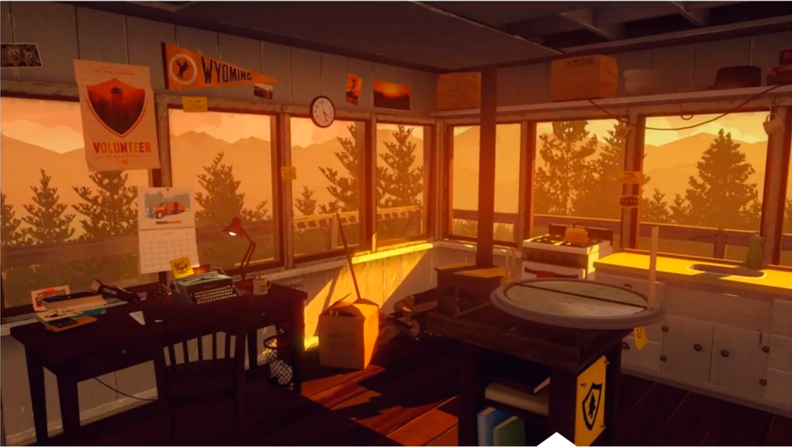
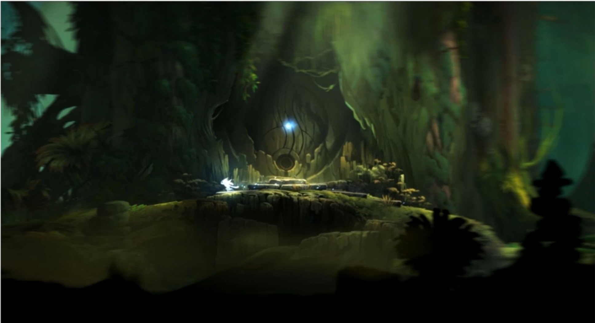
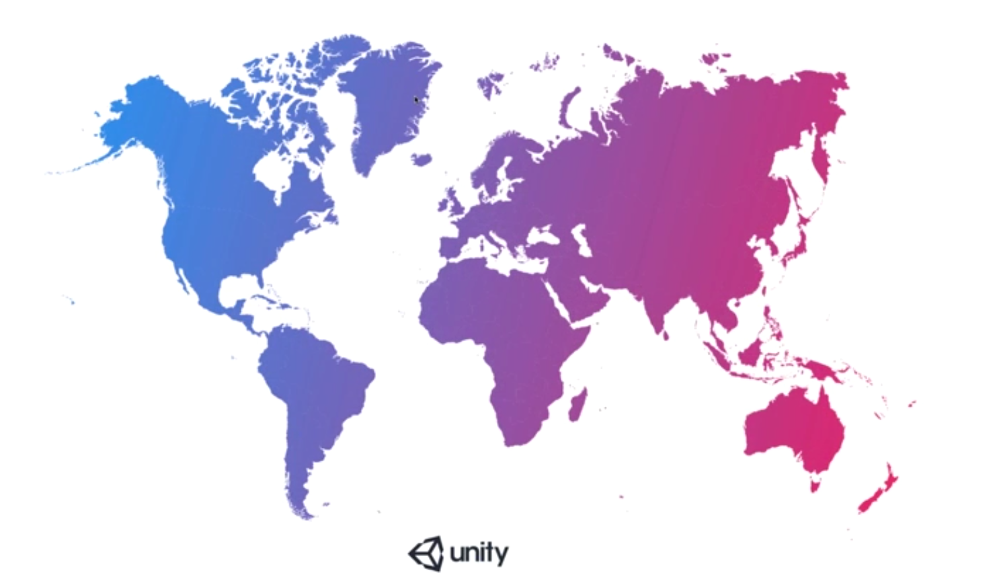
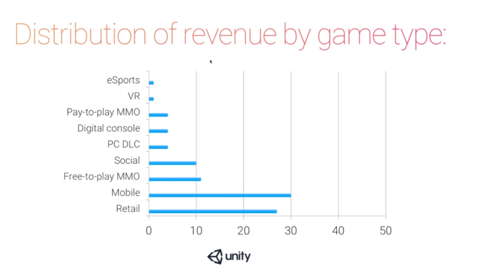
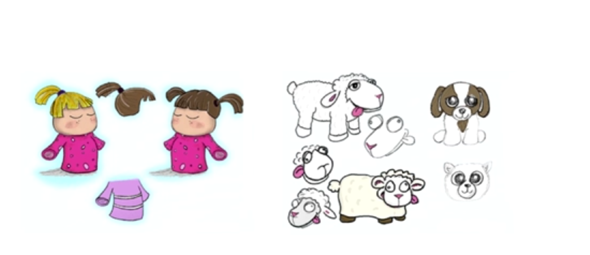
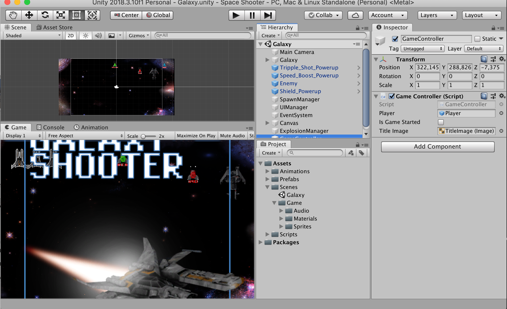
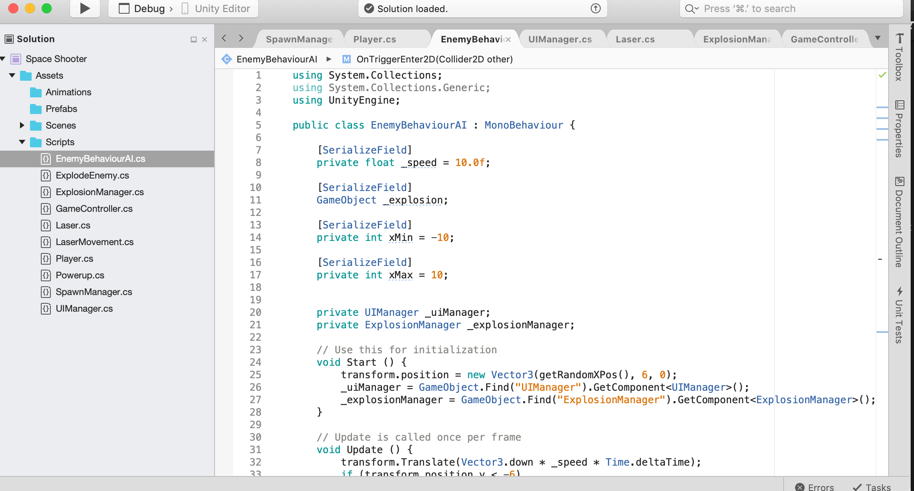
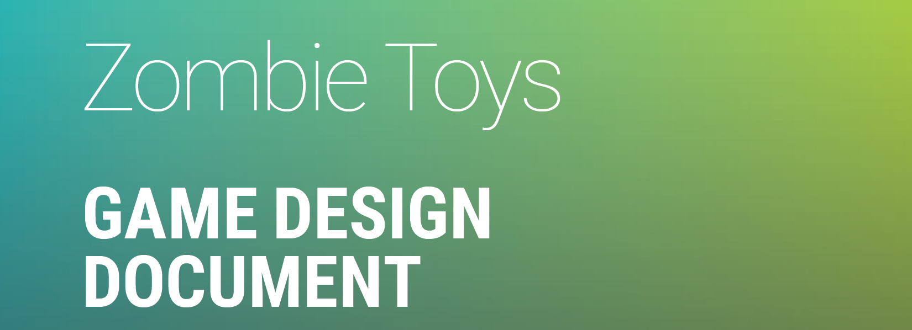
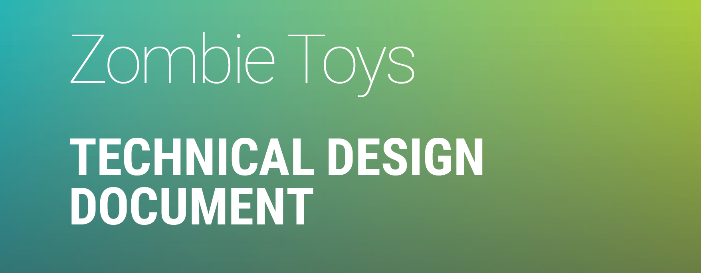

# Welcome to Unity

## What is Unity 

Unity is a game development engine used to create both 2D and 3D Games. 

## Introduction to Game Production

When designing games its important to take into consideration the following :

- Platform on which the game will be played
- The category and genre of the game
- Demographics of the players

- Video Game Platforms and Genres
- Describing the Game Production Pipeline
- Game Development Jobs and Roles
- The Game Design Document
- The Technical Design Document

### Video Game Platforms and Genres

### Game Platforms

Unity is used to create games for the following platforms :

#### Desktop
- Windows
- Mac
- Linux

#### Console
- Xbox One
- Playstation 4
- Wii U

#### Mobile
- iOS
- Android
- Windows Phone

#### VR
- HTC Vive
- Oculus Rift
- Playstation VR

#### TV
- Apple TV
- Android TV
- Samsung SMART TV

### Web
- Unity Web Player
- Web GL

## Video Game Genre

When planning to develop a game, you will need to think about what sort of game you are going to develop. Games are usually categorized into the following:

- Action
- Fighting
- Platform
- RPG
- Sports
- Adventure
- Graphics
- Puzzle
- Shooter
- Strategy
- Arcade
- Racing
- Simulation
- Survival

We can also categorize the games by how the player views the game. The game could be categorized as :

- First Person
- Third Person

### First Person

In a first person game, the player sees the game as the character. _FireWatch_ is an example of a first person game.

## Third Person

In a third person game, the player see the main character from outside the game. The main character is the first person, the NPC are the second, and the players is the third person. The player can see most of the world.

Here is _Ori and the Blind Forest_, which a third person platformer game.

Games can also be categorized as :

- Hard core
- Casual

### Hard Core Games

- Designed for the console platforms
- Feature long missions and quest
- Complex game mechanics
- Required a lot of compute resources
- High graphics quality

### Casual

- Designed to played in short burst of time
- Designed for mobile
- Designed for hardware with constrained resources
- Feature simple game mechanics, e.g aracade, board, platfomer styles

## Game Markets

When designing games you need to consider the market for the game. Games are services and varying monetization strategies raises the stakes for a game to engage users and develop different means of reaching and motivating users to purchase.

Here are the game markets by numbers :

- North America 32%
- Latin America 4%
- Europe, Middle East and Africa 28%
- Asia and Pacific 36%

## Growth Factors in Gaming

### Free to play game, Easy adoption
- Easy adoption to engage players

### Mobile Games
- Low cost technology and widespread networks

## Video Game Production Pipeline

### Pre-production

- Generating the story and concept art
- Creating the Game Design Design Document and Technical Design Document
- Look at existing intellectual property or creating a new one
- Game Levels
- Character concepts
- Blue prints
- Game mechanics

### Production

- Implementing assets and creating game play
- Creating assets in 2D and 3D Software
- Building the game for first release

### Maintenance

- Fixing bugs and releasing patches
- Incremental functionality improvements

### Upgrade

- Building and releasing new content
- Major additions and modifications, such as new levels or seasonal content

## Game Studio Roles and Responsibilities

### Art Director

- Ensures the overall look and feels is consistent
- Verifies that all game assets adheres to the concept art and intellectual property specifications

### Concept Artist

- Generates the initial ideas of characters and environments for the game
- Defines the look and feels of game level elements
In a large studio they could also be a _Character Artist_.

### The Level Designer

- Plans and builds environments
- May also light the level and add characters depending on studio size
- Uses programs such as Adobe Photoshop, 3D Max, Maya

### The Game Designer

- Designs and implements game mechanics and game play in the levels
- May do scripting of behaviours and animations
- Maybe the same person as the Level Designer depending ont he studio size.

### Technical Artist
- A recent role in game development
- Helps bring assets into the game, including animations
- Ensures art is optimized for a game engine
- The interface between the content artist and the game designers

### The Environment Artist
- Constructs environment assets including models and textures
- May create environment concept art depending on the studio size
- May lap into the role of the _Level Designer_

### The Concept Artist

- Constructs characters and props including models and textures
- Uses authoring software such as Autodesk Maya, Autodesk ZBrush, Mudbox, Autodesk 3DX Max
- May create character concepts art depending on studio size

## The Game Design Document

- High concept of the game
- Unique selling point
- Platform minimum requirements
- Game rules
- Game titles
- Game objectives

## Technical Design Document

- Technical requirements of the project
- Software used
-  Platform requirements
- Equipment used and costs
- Game engine used
- Scheduling
- Game levels

