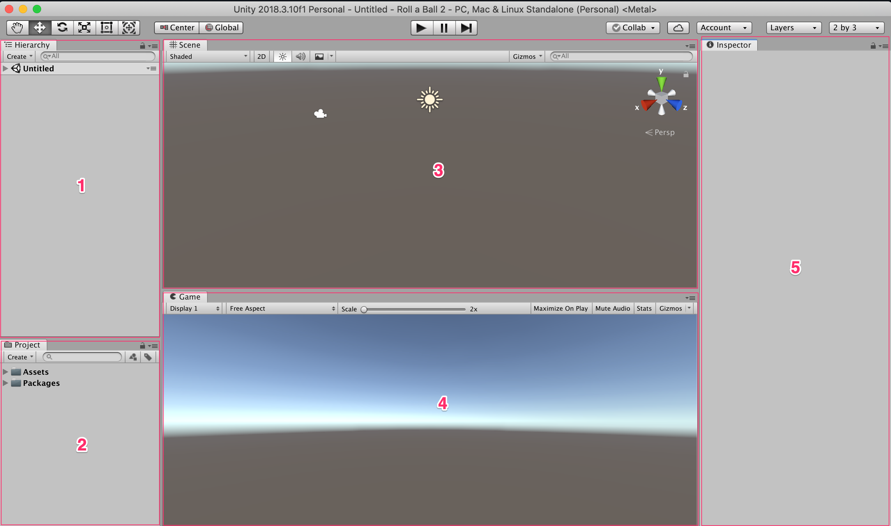

# Unity User Interface

## Interface Overview

The Unity user interface is composed of 5 main important windows :

1. Hierarchy Window
2. Project Window
3. Scene View
4. Game View
5. Inspector Window

## The Hierarchy Window

The **hierarchy window** displays the gameobjects that are currently in the scene.

## The Project Window

The project window is used to manage assets saved on the hard drive. These assets can include scripts, textures, 3d models, audio clips, scenes and many other file types.

## The Scene View

This is the window used to assemble the game. Objects are added from the project window or native Unity _gameobjects_ are create and added to the scene view. The default Unity 3D project will include a **Camera** and **Directional Light** in the game.

## The Game View

The game is used to play testing the game during development. Click the **Play** button in the toolbar to start playing the game.

## The Inspector Window

The Inspector window is used to change the different properties of the game objects. When a gameobject is selected the scene view or the hierarchy window, its properties are displayed in the _Inspector window_. 

!!! note "Note"
    By default, every gameobject have a **Transform** property in the Inspector window. ![Transform][1]

## The Toolbar

The Unity Toolbar contains the following :
- A set of buttons to move, rotate and scale the game objects
- Play and pause the game
- Access to unity services, changing the different layouts of the editor

[Unity Toolbar][2]

1. **Hand Tool** - Is used to pan around the scene view
2. **Move Tool** - Is used to move around game objects in the scene view
3. **Rotate Tool** - Is used to rotate objects in the scene view
4. **Scale Tool** - Is used to scale objects in the scene view
5. **Rect Tool** - Is used to manipulate the rectangle of 2D and UI objects in the scene view. It can be used to move around objects in the scene.
6. **Move, Rotate or Scale** - This tools is used to apply both the move, rotate and scaling the gameobject at the same time.
7. **Toggle Handle Position Tool** - Is used to select the between pivot position or center position of the gameobject
8. **Toggle Handle Rotation** - Is used to toggle rotation of the gameobject in the world or locally by the gameobject axis.
9. **Play** - Play the game
10. **Pause** - Pause the game during play
11. **Step** - Move one frame in the game
12. **Unity Collaboration** - Enable collaboration on the Unity project. Once collaboration is enabled, multiple teams can work on the same project.
13. **Unity Services** - Access the various services provided by Unity
14. **Account** - Login or manage Unity account
15. **Layers** - Toggle which layers are visible in the Scene view
16. **Layout** - Access options to change the default Unity project or create and save your own layout.

## Build and Player Settings

Settings to control which input and keys are used can be changed by accessing ** Edit** -> **Project Settings** -> **Input**.

[1]: images/transform.png
[2]: images/unity-toolbar.png